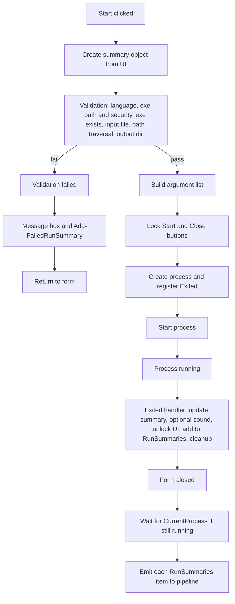

> **Notice:** This repository is provided **as is** and is **no longer actively maintained**. For a maintained alternative with more features, see **[meetily.ai](https://github.com/Zackriya-Solutions/meeting-minutes)**.

# Faster Whisper Standalone GUI (PowerShell)

A Windows application that converts speech in audio and video files into text. It provides a simple graphical interface -- no command-line knowledge needed for basic use.

**What it does:** Select an audio or video file (MP3, WAV, MP4), pick your settings, click "Start Transcription", and get a text transcript, subtitle file, or English translation.

All processing happens locally on your computer. No files are uploaded to the internet.

## Quick Start for Windows Users

**What you need:**
1. **Windows 10 or later**
2. **PowerShell 7+** -- Download from [Microsoft](https://learn.microsoft.com/en-us/powershell/scripting/install/installing-powershell-on-windows) if you do not have it
3. **faster-whisper-xxl.exe** -- Download from [Purfview/whisper-standalone-win](https://github.com/Purfview/whisper-standalone-win) and place it in the same folder as the script

**How to run:**
1. Right-click `run_faster_whisper_xxl.ps1` and select **Run with PowerShell 7** (or open PowerShell 7 and type `.\run_faster_whisper_xxl.ps1`)
2. Click **Browse** to select your audio or video file
3. Choose your settings (the defaults work well for most files)
4. Click **Start Transcription**
5. When finished, a message tells you where the output was saved

**Recommended first-time settings:**
- Model Size: `medium` (good balance of speed and accuracy)
- Device: `cpu` (works on any computer; use `cuda` if you have an NVIDIA GPU)
- Output Format: `txt` for plain text, `srt` for subtitles

## What this is (technical)

This project provides a WinForms-based GUI (`run_faster_whisper_xxl.ps1`) that launches an external transcription executable (default: `faster-whisper-xxl.exe`) with parameters selected in the GUI.
The GUI is intended for interactive use, while the pipeline output is intended for automation (CSV/JSON logging, filtering for failures, etc.).

## How it works

High-level flow from script start to pipeline output:

```mermaid
flowchart LR
  ScriptStart[Script start]
  STACheck[STA check]
  Relaunch[Relaunch in STA if needed]
  LoadModule[Load module]
  LoadConfig[Load config JSON or defaults]
  BuildForm[Build form and prefill UI]
  ShowForm[Show modal form]
  UserAction[User selects file and options]
  StartClick[User clicks Start]
  BuildSummary[Build summary object]
  Validation[Run validation chain]
  ShowError[Message box and Add-FailedRunSummary]
  StartProcess[Start external process]
  RegisterExited[Register Exited event and lock UI]
  ProcessRun[Process runs]
  ExitedHandler[Exited handler updates summary and adds to RunSummaries]
  UnlockUI[Unlock UI and cleanup event]
  FormClose[User closes form]
  WaitProcess[Wait for any still-running process]
  EmitPipeline[Emit all RunSummaries to pipeline]
  ScriptStart --> STACheck
  STACheck -->|not STA| Relaunch
  STACheck -->|STA| LoadModule
  Relaunch -->|new process| ScriptStart
  LoadModule --> LoadConfig
  LoadConfig --> BuildForm
  BuildForm --> ShowForm
  ShowForm --> UserAction
  UserAction --> StartClick
  StartClick --> BuildSummary
  BuildSummary --> Validation
  Validation -->|fail| ShowError
  ShowError --> StartClick
  Validation -->|pass| StartProcess
  StartProcess --> RegisterExited
  RegisterExited --> ProcessRun
  ProcessRun --> ExitedHandler
  ExitedHandler --> UnlockUI
  UnlockUI --> StartClick
  UserAction --> FormClose
  FormClose --> WaitProcess
  WaitProcess --> EmitPipeline
```



The script enforces STA execution, builds the WinForms UI, and validates every run before process launch. Validation failures do not start the executable and are converted into failed run summaries so automation still has a complete log. Successful runs register an exit handler, unlock UI controls on completion, and emit structured summaries to the pipeline.

## Lifecycle

From **Start** click to pipeline emission for a single run:



Each run starts from UI input, creates a summary object, and passes through a strict validation chain. Failed validation branches return to the form immediately with a user-visible error and a recorded failure object. Successful runs launch the process, handle exit events, then emit normalized summary records after form closure.

## Features

- WinForms GUI for selecting:
  - Audio/video file (MP3, WAV, MP4) and output directory
  - Processing device: `cpu` or `cuda` (NVIDIA GPU)
  - Language (2-letter code, or leave empty for auto-detection)
  - Model size: `base`, `medium`, `large-v2`, `xxl`
  - Output format: `txt` (plain text), `srt` (subtitles), `vtt` (web subtitles)
  - Task: `transcribe` or `translate` (to English)
  - Advanced decoding parameters (`best_of`, `beam_size`, `patience`, `temperature`)
  - Completion notification sound
  - Console progress display
- Automation-friendly output: one structured `PSCustomObject` per run
- JSON configuration for default GUI values (optional)

## Requirements

- Windows (WinForms GUI; not supported on macOS/Linux)
- PowerShell 7+ (`pwsh`)
- Faster Whisper standalone executable available:
  - in the same folder as the script, or
  - in `PATH`, or
  - configured via JSON (`ExecutablePath`)

## Quickstart (GUI)

See [Quick Start for Windows Users](#quick-start-for-windows-users) above for a step-by-step guide.

```powershell
.\run_faster_whisper_xxl.ps1
```

If started from a non-STA session, the script relaunches itself in STA mode automatically.
Select an input file, configure options, click **Start Transcription**, and the result is saved to your chosen output folder. A structured run summary object is emitted to the pipeline for automation.

## Configuration (optional JSON)

Create `run_faster_whisper_xxl.config.json` next to `run_faster_whisper_xxl.ps1` (copy from `run_faster_whisper_xxl.config.json.example`).

Supported keys (all optional):

- `ExecutablePath` (string)
- `Device` (`cpu` or `cuda`)
- `Language` (string)
- `Model`
- `OutputFormat` (`txt|srt|vtt`)
- `Task` (`transcribe|translate`)
- `BestOf` (number)
- `BeamSize` (number)
- `Patience` (number)
- `Temperature` (number)
- `PlayConfirmationSound` (boolean)
- `ShowCliProgress` (boolean)
- `UseInputDirectoryAsOutput` (boolean)

Example:

```json
{
  "ExecutablePath": "faster-whisper-xxl.exe",
  "Device": "cuda",
  "Language": "en",
  "Model": "medium",
  "OutputFormat": "txt",
  "Task": "transcribe",
  "BestOf": 3,
  "BeamSize": 5,
  "Patience": 1.2,
  "Temperature": 0.0,
  "PlayConfirmationSound": false,
  "ShowCliProgress": true,
  "UseInputDirectoryAsOutput": true
}
```

## Automation / logging

Even though the script is GUI-driven, it produces a structured object output that you can capture in an STA session.

```powershell
pwsh -NoProfile -STA -Command '$result = .\run_faster_whisper_xxl.ps1; $result | Format-List *'
```

Log runs to CSV:

```powershell
pwsh -NoProfile -STA -Command '.\run_faster_whisper_xxl.ps1 | Export-Csv -NoTypeInformation -Path .\transcription-runs.csv -Append'
```

## Run summary output

The script emits one object per run with properties such as:

- `InputFile`, `OutputDirectory`, `Device`, `Language`, `Model`, `OutputFormat`, `Task`
- `BestOf`, `BeamSize`, `Patience`, `Temperature`
- `PlaySound`, `ShowCliProgress`
- `Executable`, `StartTime`, `EndTime`, `DurationSeconds`, `ExitCode`, `Succeeded`, `ErrorMessage`

## Validation (build / run / test)

Run from the repository root (PowerShell on Windows):

| Action | Command |
|--------|---------|
| **Lint** | `pwsh -NoProfile -Command 'Invoke-ScriptAnalyzer -Path . -Recurse -Settings ./PSScriptAnalyzerSettings.psd1'` |
| **Test** | `pwsh -NoProfile -Command 'Invoke-Pester'` |
| **Run GUI** | `.\run_faster_whisper_xxl.ps1` |

There is no separate build step; the script and module are run directly.

## Repository layout

```
faster-whisper-standalone-GUI/
├── .editorconfig, .gitattributes, .gitignore
├── ARCHIVE.md, CONTRIBUTING.md, LICENSE, PSScriptAnalyzerSettings.psd1
├── README.md, SECURITY.md
├── run_faster_whisper_xxl.ps1
├── run_faster_whisper_xxl.config.json.example
├── Module/
│   ├── FasterWhisperStandaloneGui.psd1, FasterWhisperStandaloneGui.psm1
│   ├── Private/   (config helpers: Get-ConfigBoolOrDefault, Get-ConfigNumberOrDefault, Get-ConfigStringOrDefault, Get-JsonObjectFromFile)
│   └── Public/    (Get-FasterWhisperArgumentList, Get-FasterWhisperGuiConfig, Get-FasterWhisperGuiDefaultConfig,
│                   Get-FasterWhisperOutputDirectory, Get-FasterWhisperAllowedValueMap (alias: Get-FasterWhisperAllowedValues), Test-PathTraversalSafe, Test-SafeExecutablePath)
└── tests/
    └── FasterWhisperStandaloneGui.Tests.ps1
```

For archive notice and maintained alternative, see [ARCHIVE.md](ARCHIVE.md).

## Security

- Do not include secrets or personal data in issues, logs, or test fixtures.
- For reporting vulnerabilities, see `SECURITY.md`.

## Troubleshooting

- **”Transcription engine not found”**: Download `faster-whisper-xxl.exe` from [Purfview/whisper-standalone-win](https://github.com/Purfview/whisper-standalone-win) and place it in the same folder as the script. Alternatively, add its location to your system PATH or set `ExecutablePath` in the JSON config file.
- **No output files created**: Make sure the input file exists and the output folder is writable. Try selecting a different output directory.
- **CUDA errors or GPU problems**: Switch the Processing Device to `cpu` to verify the tool works, then check that your NVIDIA GPU drivers and CUDA toolkit are correctly installed.
- **No progress shown during transcription**: Check the “Show progress in console window” option before starting.
- **Script does not start**: Make sure you are using PowerShell 7+ (`pwsh`), not Windows PowerShell 5.1. You can check your version by running `$PSVersionTable.PSVersion` in PowerShell.

## Alternatives & Successors

> This project is archived. Consider these actively maintained alternatives:

| Project | Description | Link |
|---------|-------------|------|
| Buzz | Cross-platform Whisper GUI (Python) | [GitHub](https://github.com/chidiwilliams/buzz) |
| MacWhisper | Native macOS Whisper transcription app | [goodsnooze.gumroad.com](https://goodsnooze.gumroad.com/l/macwhisper) |
| Whisper.cpp | High-performance C++ Whisper port with GUIs | [GitHub](https://github.com/ggerganov/whisper.cpp) |
| Vibe | Cross-platform Whisper GUI built on whisper.cpp | [GitHub](https://github.com/thewh1teagle/vibe) |

## License

MIT. See `LICENSE`.
