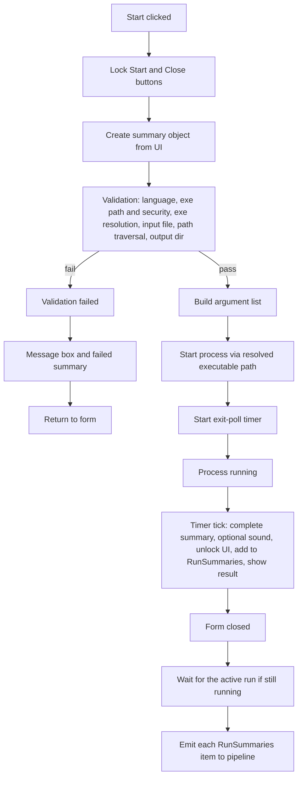

> **Notice:** This repository is provided **as is** and is **no longer actively maintained**.
>
> **Better alternatives:** [Buzz](https://github.com/chidiwilliams/buzz) (cross-platform), [Vibe](https://github.com/thewh1teagle/vibe) (cross-platform, whisper.cpp) and [MacWhisper](https://goodsnooze.gumroad.com/l/macwhisper) (macOS) are maintained, more capable, and easier to install than this Windows-only PowerShell wrapper. See [Alternatives & Successors](#alternatives--successors).

# Faster Whisper Standalone GUI (PowerShell)

A Windows application that converts speech in audio and video files into text. It provides a simple graphical interface -- no command-line knowledge needed for basic use.

**What it does:** Select an audio or video file (MP3, WAV, MP4), pick your settings, click "Start Transcription", and get a text transcript, subtitle file, or English translation.

All processing happens locally on your computer. No files are uploaded to the internet.

## Quick Start for Windows Users

**What you need:**
1. **Windows 10 or later**
2. **PowerShell 7+** -- Download from [Microsoft](https://learn.microsoft.com/en-us/powershell/scripting/install/installing-powershell-on-windows) if you do not have it
3. **faster-whisper-xxl.exe** -- Download from [Purfview/whisper-standalone-win](https://github.com/Purfview/whisper-standalone-win) and place it in the same folder as the script

**How to run:**
1. Right-click `run_faster_whisper_xxl.ps1` and select **Run with PowerShell 7** (or open PowerShell 7 and type `.\run_faster_whisper_xxl.ps1`)
2. Click **Browse** to select your audio or video file
3. Choose your settings (the defaults work well for most files)
4. Click **Start Transcription**
5. When finished, a message tells you where the output was saved

**Recommended first-time settings:**
- Model Size: `medium` (good balance of speed and accuracy)
- Device: `cpu` (works on any computer; use `cuda` if you have an NVIDIA GPU)
- Output Format: `txt` for plain text, `srt` for subtitles

## What this is (technical)

This project provides a WinForms-based GUI (`run_faster_whisper_xxl.ps1`) that launches an external transcription executable (default: `faster-whisper-xxl.exe`) with parameters selected in the GUI.
The GUI is intended for interactive use, while the pipeline output is intended for automation (CSV/JSON logging, filtering for failures, etc.).

## How it works

High-level flow from script start to pipeline output:


```mermaid
flowchart LR
  ScriptStart[Script start]
  STACheck[STA check]
  Relaunch[Relaunch in STA if needed]
  LoadModule[Load module]
  LoadConfig[Load config JSON or defaults]
  BuildForm[Build form and prefill UI]
  ShowForm[Show modal form]
  UserAction[User selects file and options]
  StartClick[User clicks Start]
  BuildSummary[Build summary object]
  Validation[Run validation chain]
  ShowError[Message box and failed summary]
  StartProcess[Start external process]
  RegisterExited[Lock UI and start exit-poll timer]
  ProcessRun[Process runs]
  ExitedHandler[Timer sees exit, completes summary and adds to RunSummaries]
  UnlockUI[Unlock UI and show result]
  FormClose[User closes form]
  WaitProcess[Wait for a still-running process and complete its summary]
  EmitPipeline[Emit all RunSummaries to pipeline]
  ScriptStart --> STACheck
  STACheck -->|not STA| Relaunch
  STACheck -->|STA| LoadModule
  Relaunch -->|new process| ScriptStart
  LoadModule --> LoadConfig
  LoadConfig --> BuildForm
  BuildForm --> ShowForm
  ShowForm --> UserAction
  UserAction --> StartClick
  StartClick --> BuildSummary
  BuildSummary --> Validation
  Validation -->|fail| ShowError
  ShowError --> StartClick
  Validation -->|pass| StartProcess
  StartProcess --> RegisterExited
  RegisterExited --> ProcessRun
  ProcessRun --> ExitedHandler
  ExitedHandler --> UnlockUI
  UnlockUI --> StartClick
  UserAction --> FormClose
  FormClose --> WaitProcess
  WaitProcess --> EmitPipeline
```

The script enforces STA execution, builds the WinForms UI, and validates every run before process launch. Validation failures do not start the executable and are converted into failed run summaries so automation still has a complete log. Started runs are polled for exit by a UI-thread timer, which completes the summary and unlocks the UI. All summaries are emitted to the pipeline when the window closes.

## Lifecycle

From **Start** click to pipeline emission for a single run:


```mermaid
flowchart TB
  StartClick[Start clicked]
  CreateSummary[Create summary object from UI]
  Validation[Validation: language, exe path and security, exe resolution, input file, path traversal, output dir]
  ValidationFail[Validation failed]
  MsgBox[Message box and failed summary]
  Return[Return to form]
  BuildArgs[Build argument list]
  LockUI[Lock Start and Close buttons]
  CreateProcess[Start process via resolved executable path]
  StartProc[Start exit-poll timer]
  ProcRunning[Process running]
  OnExit["Timer tick: complete summary, optional sound, unlock UI, add to RunSummaries, show result"]
  FormClosed[Form closed]
  WaitForProc[Wait for the active run if still running]
  EmitToPipeline[Emit each RunSummaries item to pipeline]
  StartClick --> LockUI
  LockUI --> CreateSummary
  CreateSummary --> Validation
  Validation -->|fail| ValidationFail
  ValidationFail --> MsgBox
  MsgBox --> Return
  Validation -->|pass| BuildArgs
  BuildArgs --> CreateProcess
  CreateProcess --> StartProc
  StartProc --> ProcRunning
  ProcRunning --> OnExit
  OnExit --> FormClosed
  FormClosed --> WaitForProc
  WaitForProc --> EmitToPipeline
```

Each run starts from UI input, creates a summary object, and passes through a strict validation chain. Failed validation branches return to the form immediately with a user-visible error and a recorded failure object. Successful runs launch the process and are completed when it exits; if the window is closed first, the script waits for the process (or stops it, if you choose so) before emitting all summary records.

## Features

- WinForms GUI for selecting:
  - Audio/video file (MP3, WAV, MP4) and output directory
  - Processing device: `cpu` or `cuda` (NVIDIA GPU)
  - Language (2-letter code, or leave empty for auto-detection)
  - Model size: `base`, `medium`, `large-v2`, `xxl`
  - Output format: `txt` (plain text), `srt` (subtitles), `vtt` (web subtitles)
  - Task: `transcribe` or `translate` (to English)
  - Advanced decoding parameters (`best_of`, `beam_size`, `patience`, `temperature`)
  - Completion notification sound
  - Console progress display
- Automation-friendly output: one structured `PSCustomObject` per run
- JSON configuration for default GUI values (optional)

## Requirements

- Windows (WinForms GUI; not supported on macOS/Linux)
- PowerShell 7+ (`pwsh`)
- Faster Whisper standalone executable available (looked up in this order):
  - configured via JSON (`ExecutablePath`; a path with a folder asks for confirmation before use), or
  - in the same folder as the script, or
  - in `PATH`

  Files with any extension other than `.exe` (for example `.cmd` or `.bat` found via `PATHEXT`) are rejected.

## Quickstart (GUI)

See [Quick Start for Windows Users](#quick-start-for-windows-users) above for a step-by-step guide.

```powershell
.\run_faster_whisper_xxl.ps1
```

If started from a non-STA session, the script relaunches itself in STA mode automatically.
Select an input file, configure options, click **Start Transcription**, and the result is saved to your chosen output folder. A structured run summary object is emitted to the pipeline for automation.

## Configuration (optional JSON)

Create `run_faster_whisper_xxl.config.json` next to `run_faster_whisper_xxl.ps1` (copy from `run_faster_whisper_xxl.config.json.example`).

Supported keys (all optional; invalid values fall back to defaults, `BestOf`/`BeamSize` are limited to 1-10 and `Patience`/`Temperature` to 0.0-2.0):

- `ExecutablePath` (string)
- `Device` (`cpu` or `cuda`)
- `Language` (string)
- `Model`
- `OutputFormat` (`txt|srt|vtt`)
- `Task` (`transcribe|translate`)
- `BestOf` (number)
- `BeamSize` (number)
- `Patience` (number)
- `Temperature` (number)
- `PlayConfirmationSound` (boolean)
- `ShowCliProgress` (boolean)
- `UseInputDirectoryAsOutput` (boolean)

Example:

```json
{
  "ExecutablePath": "faster-whisper-xxl.exe",
  "Device": "cuda",
  "Language": "en",
  "Model": "medium",
  "OutputFormat": "txt",
  "Task": "transcribe",
  "BestOf": 3,
  "BeamSize": 5,
  "Patience": 1.2,
  "Temperature": 0.0,
  "PlayConfirmationSound": false,
  "ShowCliProgress": true,
  "UseInputDirectoryAsOutput": true
}
```

## Automation / logging

Even though the script is GUI-driven, it produces a structured object output that you can capture in an STA session.

```powershell
pwsh -NoProfile -STA -Command '$result = .\run_faster_whisper_xxl.ps1; $result | Format-List *'
```

Log runs to CSV:

```powershell
pwsh -NoProfile -STA -Command '.\run_faster_whisper_xxl.ps1 | Export-Csv -NoTypeInformation -Path .\transcription-runs.csv -Append'
```

## Run summary output

When the window closes, the script emits one object per attempted run (including runs rejected by validation) with these properties, always in this order:

- `InputFile`, `OutputDirectory`, `Device`, `Language`, `Model`, `OutputFormat`, `Task`
- `BestOf`, `BeamSize`, `Patience`, `Temperature`
- `PlaySound`, `ShowCliProgress`
- `Executable`, `StartTime`, `EndTime`, `DurationSeconds`, `ExitCode`, `Succeeded`, `ErrorMessage`

`ExitCode` is empty when the engine was never started. Fields that validation did not reach (for example `Executable` after an invalid language) stay empty. A run you stop by closing the window and choosing **Yes** has `ErrorMessage` `Transcription stopped by user.`

## Validation (build / run / test)

Run from the repository root with PowerShell 7 (tests and lint also run on macOS/Linux; the GUI needs Windows). Requires Pester 5+ and PSScriptAnalyzer.

| Action | Command |
|--------|---------|
| **Lint** | `pwsh -NoProfile -Command 'Invoke-ScriptAnalyzer -Path . -Recurse -Settings ./PSScriptAnalyzerSettings.psd1 -EnableExit'` |
| **Test** | `pwsh -NoProfile -Command 'Invoke-Pester -Path tests -CI'` |
| **Run GUI** | `.\run_faster_whisper_xxl.ps1` |

There is no separate build step; the script and module are run directly. CI (`.github/workflows/ci.yml`) runs the same lint and test commands on `windows-latest`.

## Repository layout

```
faster-whisper-standalone-GUI/
├── run_faster_whisper_xxl.ps1        Entry point: STA bootstrap, WinForms window, run polling, pipeline output
├── run_faster_whisper_xxl.config.json.example
├── Module/                           FasterWhisperStandaloneGui module: all non-UI logic, loads on any OS
│   ├── FasterWhisperStandaloneGui.psd1   Manifest; FunctionsToExport is the only export list
│   ├── FasterWhisperStandaloneGui.psm1   Dot-sources Private/ then Public/
│   ├── Public/    Get-FasterWhisperOptionCatalog, Get-FasterWhisperGuiConfig,
│   │              Initialize-FasterWhisperRun, Invoke-FasterWhisperRun, Complete-FasterWhisperRun
│   └── Private/   config parsing, defaults, executable resolution and safety checks,
│                  argument list, output directory, summary finalization
├── tests/         Pester tests: Settings (catalog, config), Run (request to process and summary),
│                  PathSafety (security checks), ScriptContract (script vs. module exports)
├── PSScriptAnalyzerSettings.psd1     Lint configuration (severity Error, Warning)
└── .github/       CI workflow and Dependabot
```

Dependency direction: the entry script depends on the module's public functions; the module never references WinForms. Put new validation, settings or process logic in the module (one function per file, private unless the script needs it) and keep the script limited to UI.

For archive notice and maintained alternative, see [ARCHIVE.md](ARCHIVE.md).

## Security

- Do not include secrets or personal data in issues, logs, or test fixtures.
- For reporting vulnerabilities, see `SECURITY.md`.

## Troubleshooting

- **”Transcription engine not found”**: Download `faster-whisper-xxl.exe` from [Purfview/whisper-standalone-win](https://github.com/Purfview/whisper-standalone-win) and place it in the same folder as the script. Alternatively, add its location to your system PATH or set `ExecutablePath` in the JSON config file.
- **No output files created**: Make sure the input file exists and the output folder is writable. Try selecting a different output directory.
- **CUDA errors or GPU problems**: Switch the Processing Device to `cpu` to verify the tool works, then check that your NVIDIA GPU drivers and CUDA toolkit are correctly installed.
- **No progress shown during transcription**: Check the “Show progress in console window” option before starting.
- **Script does not start**: Make sure you are using PowerShell 7+ (`pwsh`), not Windows PowerShell 5.1. You can check your version by running `$PSVersionTable.PSVersion` in PowerShell.

## Alternatives & Successors

> This project is archived. Consider these actively maintained alternatives:

| Project | Description | Link |
|---------|-------------|------|
| Buzz | Cross-platform Whisper GUI (Python) | [GitHub](https://github.com/chidiwilliams/buzz) |
| MacWhisper | Native macOS Whisper transcription app | [goodsnooze.gumroad.com](https://goodsnooze.gumroad.com/l/macwhisper) |
| Whisper.cpp | High-performance C++ Whisper port with GUIs | [GitHub](https://github.com/ggerganov/whisper.cpp) |
| Vibe | Cross-platform Whisper GUI built on whisper.cpp | [GitHub](https://github.com/thewh1teagle/vibe) |

## License

MIT. See `LICENSE`.
